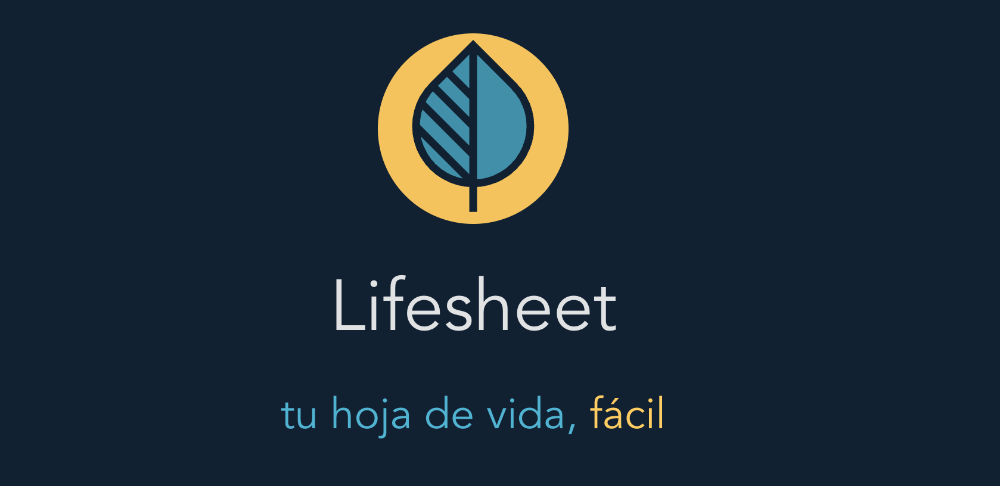

# Lifesheet

Lifesheet ("hoja de vida" in Spanish) is an online tool that helps you build a professional resume with the help of co:here AI



## Stack

-   Vue 3
-   TypeScript
-   Vite
-   Tailwind

## Run locally

```bash
git clone git@github.com:sguerra/lifesheet.git
cd lifesheet
pnpm install
pnpm run dev
```

## Recommended Setup

-   pNPm
-   [VS Code](https://code.visualstudio.com/).
