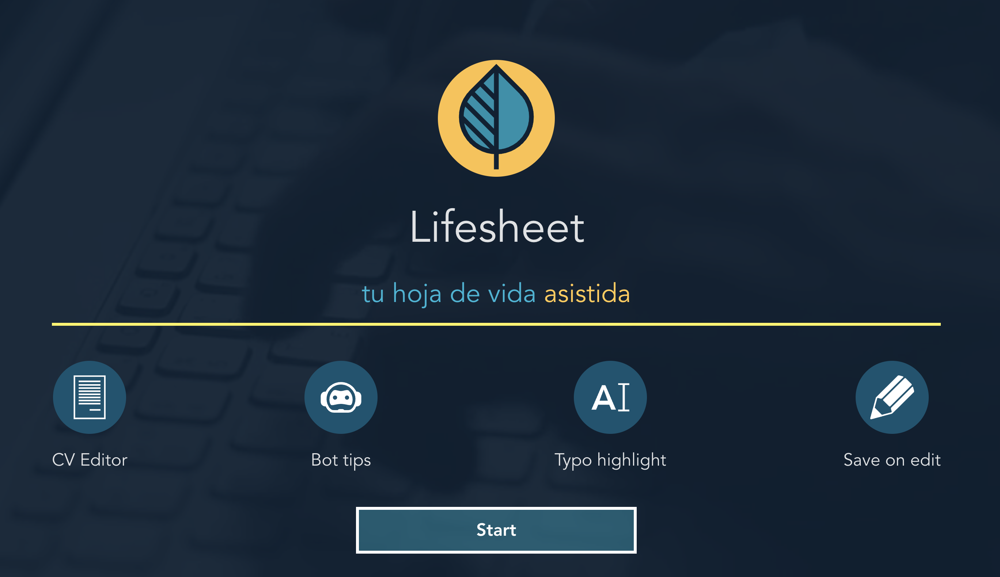
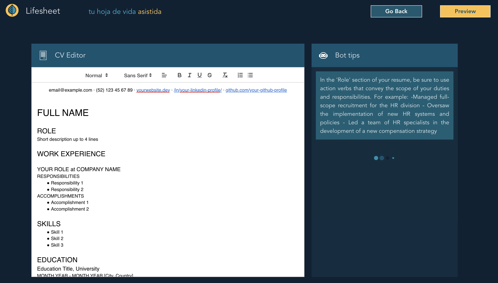
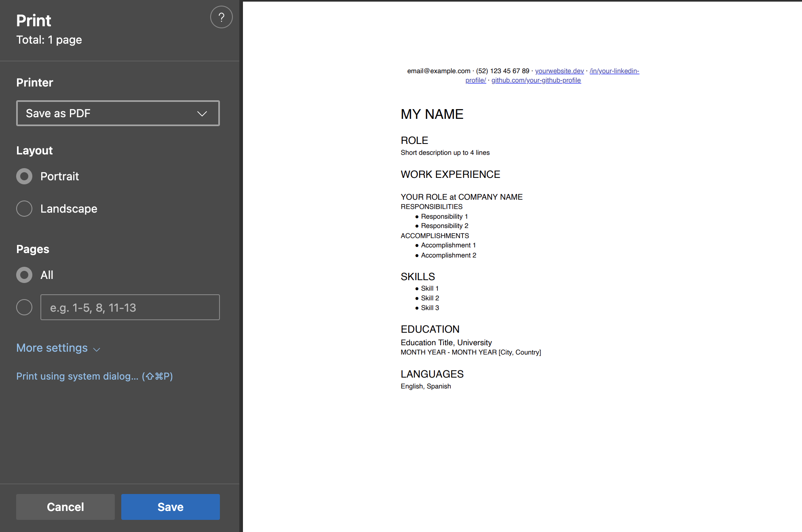

# Lifesheet

Lifesheet ("hoja de vida" in Spanish) is an online tool that helps you build a professional resume with the help of co:here AI



## Features

-   CV Editor with typo highlighting (Rich Text)
    -   Initial template based on: [Apply to tech companies with this CV template](https://delacruzdev.notion.site/Apply-to-tech-companies-with-this-CV-template-fd977e7e715d4445a6ba1878a500e327)
-   Bot Tips (Every 30s, powered by co:here AI)



-   Save on Edit & Ready to share
-   Preview and Print page



## Stack

[](https://dashboard.cohere.ai)
[](https://vuejs.org)
[](https://www.typescriptlang.org//)
[](https://vitejs.dev)
[](https://quilljs.com)
[](https://tailwindcss.com/)

## Live Sample

[](http://143.110.153.184:5173)

## Run locally

```bash
git clone git@github.com:sguerra/lifesheet.git
cd lifesheet
pnpm install

# Rename .env.sample file to .env and replace VITE_COHERE_API_KEY with your co:here API key

pnpm run dev
```

## Recommended Setup

[](https://pnpm.io)
[](https://code.visualstudio.com/)

## Future work

-   Responsive design for mobile
-   More AI interactions on text selection for corrections / suggestions
